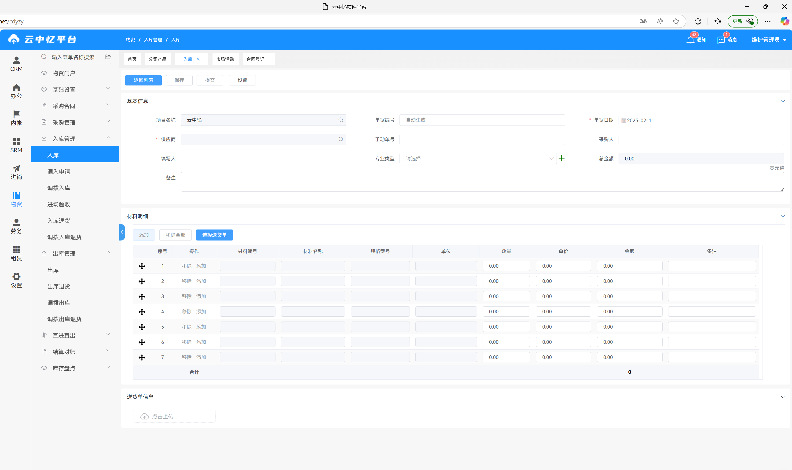
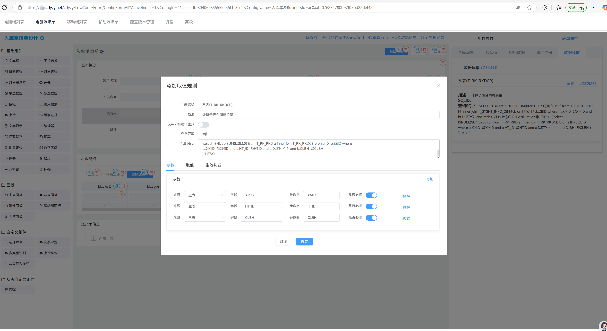
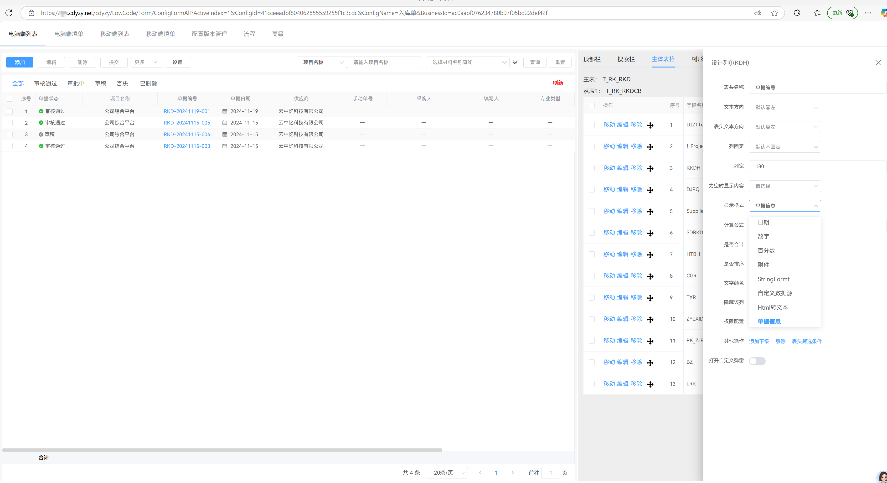
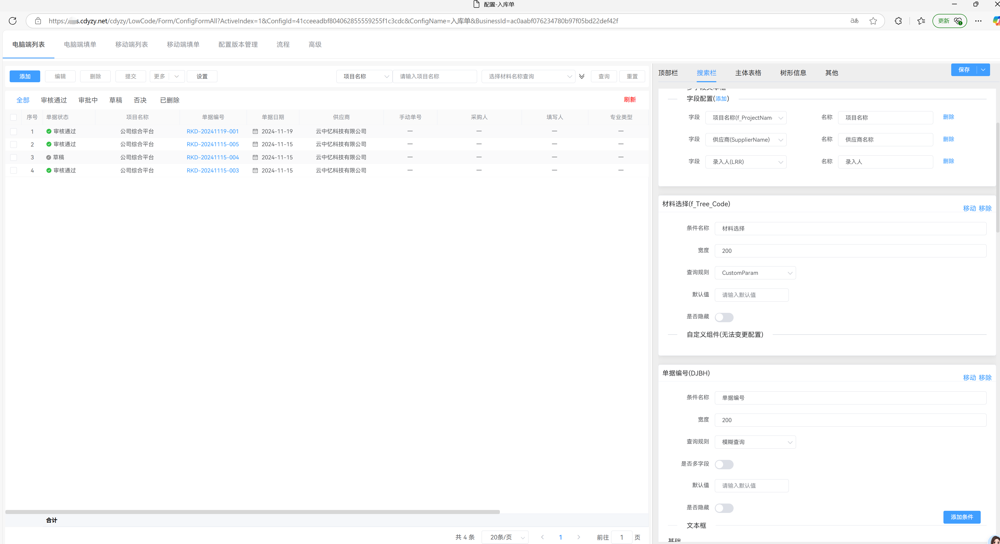
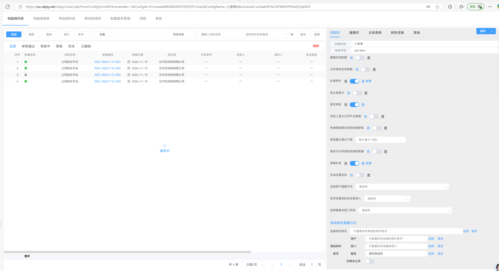
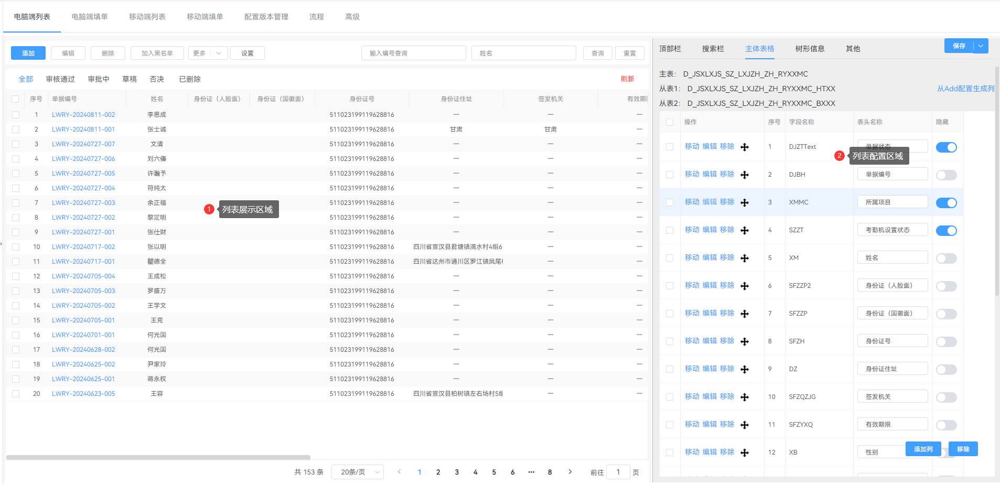

# 云中忆低代码平台LowCodePlatform ✨
**低代码平台（Net6.0+、Vue、SqlSugar）**
**让企业级应用开发效率提升10倍的全栈低代码解决方案** 🚀

## 🌟 核心优势
### 多数据库支持
- **无缝兼容**：MySQL 8.x / SQL Server 2008+ / 达梦DM8 / Oracle
- **智能适配**：自动生成DDL语句，支持跨库迁移工具
- **性能优化**：内置分库分表策略，支持大规模数据量
- **跨平台**：支持信创，多平台运行

## 🥵核心功能
| 功能模块 | 技术亮点 | 应用场景 |
|---------|---------|---------|
| 自定义表单 | 自定义拖拉组件 | 在elementui基础上实现二次封装 |
| 智能流程审批 | 基于BPMN 2.0的可视化编排 | 财务报销/采购审批及自定义业务审批 |
| 混合渲染引擎 | Canvas+SVG双模渲染 | 复杂报表设计，支持自定义sql模式 |
| 手写签名 | 基于TensorFlow的笔迹校验 | 电子合同签署 |
| API工厂 | 支持OpenAPI 3.1 | 第三方系统集成，可自行可视化配置 |
| 标准合同 | 可视化配置 | 把word模式配置为系统填写模式 |
| 打印配置 | 可视化配置 | 根据需求配置打印格式 |
| 门户首页 | 自定义门户首页 | 根据不同部门配置不同的首页 |

## 📱 移动端适配
| 平台 | 技术方案 | 特性 |
|------|---------|------|
| iOS | uniapp | 支持自定义上架 |
| Android | uniapp | 支持各大厂商应用商店上架 |
| 企业微信 | uniapp | 已集成对接，支持自建应用和服务商模式 |
| 钉钉 | uniapp | 已集成对接，支持自建应用和服务商模式 |

📞 **立即咨询** | [官网链接](https://www.cdyzy.net/) | [在线演示](https://www.cdyzy.net/TryChooseTest.html)

## 🎁系统截图
**1、系统主页面**

**2、列表页面配置**

**3、标准合同配置**

**4、打印配置**

**5、移动端配置**

**6、审批流程配置**

**7、门户首页配置**

**9、报表配置**

**10、代码截图**

📞 **立即咨询** | [官网链接](https://www.cdyzy.net/) | [在线演示](https://www.cdyzy.net/TryChooseTest.html)

